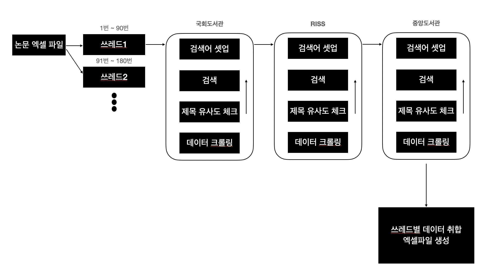

# project-lupin
## 업무 흐름 도식

## 검색어 리스트
* 논문 이름 전체 (ex. 한글이름 : 부제 = english_name : subtitle)
* 한글 이름만 (ex. 한글이름 : 부제)
* 영어 이름만 (ex. english_name : subtitle)
* 부제 제외한 한글 이름 (ex. 한글이름)
* 부제 제외한 영어 이름 (ex. english_name)

## 결과 신뢰도 체크
* 검색 결과로 나온 논문 전체 이름과 검색어 비교
* Komoran으로 형태소 분석 후 자카드 유사도 비교
  * 논문 전체 이름 비교
  * 영어 한글 별개로 있다면 각각 체크
  * 부제가 있다면 빼고 각각 체크

## 속도 문제
* 각각 웹의 응답속도가 제한적이기 때문에 멀티스레드로 여러개 돌리는 방식 선택
* 브라우저가 8개가 넘어가니 오히려 더 느린 느낌이다.
* 노트북 와이파이 네트워크 환경에선 성능을 100퍼 발휘하지 못하는 것 같다

## 이슈 사항
#### 멀티스레드로 전환 후 창을 여러개띄우고자 브라우저를 축소해서 배치했더니
#### 기존 잘 돌던 것들에서 에러 발생
#### 생각해보니 현재 CSS기준으로 크롤링 중인데 사이트가 반응형이라 CSS가 달라져서 그런것 같다.
#### 항상 풀사이즈를 기준으로 하기로 함.

## 패치 내역
### v1.0
* Riss 유사도 비교 시 특수문자 제거처리 추가

### v1.1
* 저자 비교 후 다르면 엑셀에 표시하도록 처리
* Riss 원문 에러팝업뜨면 서비스 불가 처리
* Riss PDF 파일 다운로드 추가(Beta)

### v1.2
* PDF 다운로드 후 각각 건수에 맞게 분할저장 기능 추가
* 중앙도서관 검색 경우의 수 소폭 하향조정함(덜 민감하게)

### v1.3
* 중앙도서관 원문 실물 서비스형태 순서 변경
